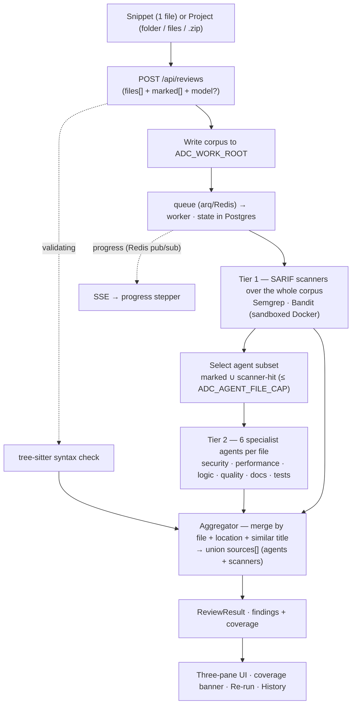

# AI Dev Companion

Intelligent, multi-step **GenAI code review**. Submit a snippet or a whole codebase and get
structured, categorized, **source-cited** findings (security / performance / logic / quality / docs /
tests / syntax) with live progress. Open-source and **local-first** — runs with **zero API keys** using
a local model (Ollama), or bring your own (OpenAI / Anthropic / any OpenAI-compatible endpoint).

Findings are **multi-source**: deterministic tree-sitter parsing, six specialist LLM agents, and
external static scanners (Semgrep + Bandit) all feed one aggregator that **merges duplicates and unions
their citations** — so a single SQL-injection card can be cited by `🤖 security-agent` **+** `🔧 bandit`
**+** `🔧 semgrep`, each chip linking to the rule.

> Built incrementally with a spec → plan → subagent-driven-TDD → PR workflow (artifacts under
> [`docs/superpowers/`](docs/superpowers/)). See the **[Roadmap](#roadmap)** for what's shipped vs. planned.

---

## Table of contents
- [Features](#features) · [Prerequisites](#prerequisites) · [Run it locally](#run-it-locally) ·
  [Configuration](#configuration) · [How to use](#how-to-use) · [API](#api) · [Architecture](#architecture) ·
  [Testing](#testing) · [Roadmap](#roadmap) · [Tech debt](#tech-debt) · [Ideas & future improvements](#ideas--future-improvements)

---

## Features
- **Two ways to review**
  - **Snippet** — paste one file, pick a **language** (real logos) and a **model**, review.
  - **Project (multi-file)** — drag-and-drop a folder / files / `.zip` (or use the buttons); a VS Code-style
    **file tree** lets you mark which files get the deep agent review.
- **Two-tier review** — static scanners (Semgrep/Bandit) cover the **whole** corpus (breadth); the 6 LLM
  agents deep-review a **bounded** subset (your marked files ∪ scanner-hit files). Large repos stay bounded.
- **Multi-source, merged citations** — one finding, many sources; agent (`🤖`) vs scanner (`🔧`) shown on
  each chip with a link to the rule.
- **Coverage + mark-and-re-run** — every file gets a status (`marked` / `scanner-hit` / `fallback` /
  `not-flagged` / `over-cap`); skipped files are surfaced so you can mark them and **Re-run** (reuses the
  ingested corpus, creates a linked review).
- **Live progress** over SSE; **History** with per-category counts (click a row to reload a past review and
  browse its files).
- **Languages:** Python, TypeScript, JavaScript, Java, Go, Rust, Bash.
- **Pluggable models** — Ollama (default, no key), OpenAI, Anthropic, or any OpenAI-compatible endpoint;
  pick the specific model per review.

---

## Prerequisites
Install these once:

| Tool | Why | Install |
|---|---|---|
| **Docker** (+ Compose) | Postgres, Redis, Ollama, and the Semgrep/Bandit scanner sandboxes | https://docs.docker.com/get-docker/ |
| **uv** | Python 3.12 deps + runner (backend) | `curl -LsSf https://astral.sh/uv/install.sh \| sh` |
| **Node.js 20+** + **pnpm** | Frontend | `corepack enable` (ships with Node) |
| **go-task** *(optional)* | Convenience `task …` commands | `brew install go-task` (or run the raw commands) |

> The default model is **local** (Ollama, pulled via Docker) — no API key required. Skip straight to the
> "memory mode" quick start if you don't want Postgres/Redis either.

---

## Run it locally

### 1. Configure
```bash
cp .env.example .env
```
Defaults work out of the box with a local model. To use a cloud model instead, set in `.env`:
```ini
ADC_MODEL_PROVIDER=openai          # or: anthropic | ollama (default)
ADC_MODEL=gpt-4o-mini
ADC_OPENAI_API_KEY=sk-...          # or ADC_ANTHROPIC_API_KEY=...
```
(The provider + key are configured here in `.env`; the **specific model** is chosen per-review in the UI.)

### 2a. Full stack (Postgres + Redis + arq worker) — durable
```bash
task up              # postgres + redis + ollama (docker compose)
task migrate         # apply DB migrations
task pull-model      # qwen2.5-coder:7b into Ollama  (skip if using a cloud provider)
task scanners-build  # build the Semgrep + Bandit scanner images (optional but recommended)
task api             # http://localhost:8000
task worker          # arq worker — runs the reviews
task web             # http://localhost:5173
```

### 2b. Lightweight "memory" mode — no Postgres/Redis/worker
For a quick demo: set `ADC_BACKEND=memory` in `.env`, then just:
```bash
task api    # reviews run in-process (non-durable)
task web
```
(Scanners still need Docker; without it — or with `ADC_SCANNERS=` — reviews run agent-only.)

> **No `go-task`?** The commands are short; run them directly, e.g.
> `docker compose -f infra/compose/docker-compose.yml up -d`,
> `cd apps/api && uv run uvicorn adc_api.main:app --port 8000`,
> `cd apps/api && uv run arq adc_api.worker.WorkerSettings`,
> `pnpm --filter web dev`.

> **Heads-up (full-stack):** the API and arq worker are separate processes, so `ADC_WORK_ROOT` must
> resolve to the **same path/volume** for both (run both from `apps/api`, or set an absolute path).

---

## How to use
Open **http://localhost:5173**.

**Snippet tab** — pick a language (logo dropdown) and a model, paste code, hit **Review Code ▶**. Watch
the progress stepper, then read the findings: each card shows category, severity, the line (click to jump
in the editor), description, recommendation, and **source chips** (`🤖` agent / `🔧` scanner, linked to rules).

**Project tab** — **drag-and-drop a folder, files, or a `.zip`** onto the left pane (or use 📄/📁/🗜 buttons).
Dependencies, VCS dirs, binaries and oversized files are filtered out automatically. In the file tree:
tick files/folders (tri-state) to choose what the **agents** deep-review; badges show scanner hits and
finding counts. Pick a model, hit **Review N file(s) ▶**. After it runs:
- the **coverage banner** shows "agents reviewed N / M · scanners covered all M";
- click any file → its findings (and inline editor markers);
- files that weren't deep-reviewed show a **skipped** tag — tick them and **Re-run ▶** to deepen coverage
  (reuses the corpus, links to the original).

**History** — a timestamped table with per-category counts; click a row to reload that review's report and
browse its files.

---

## API
| Method & path | Purpose |
|---|---|
| `POST /api/reviews` | `{ files:[{path,content,language?}], marked:[paths], model? }` (or legacy `{code,language}`) → `202 {reviewId}` |
| `POST /api/reviews/zip` | multipart `.zip` upload (server-side unzip) → `202 {reviewId}` |
| `GET /api/reviews/{id}/events` | SSE progress (`validating → analyzing → finalizing → done`/`failed`) |
| `GET /api/reviews/{id}` | final `ReviewResult` (findings with `sources[]` + `coverage`) |
| `GET /api/reviews/{id}/file?path=` | raw file content from the persisted corpus (traversal-guarded) |
| `POST /api/reviews/{id}/rerun` | `{ marked:[paths], model? }` → `202 {reviewId}` (new linked review) |
| `GET /api/reviews` | history list (rows include `fileCount`) |
| `GET /api/models` | available models for the configured provider (powers the model dropdown) |

---

## Architecture
- **`packages/core`** — Findings schema (the stable, citation-ready contract), input sanitization, tree-sitter
  syntax checks.
- **`apps/api`** — FastAPI job API + **LangGraph multi-agent engine** (6 specialists → aggregator). Reviews
  persist in **Postgres**, run on an **arq/Redis worker** (or in-process with `ADC_BACKEND=memory`), and the
  per-review corpus is stored under `ADC_WORK_ROOT`. Seams: `ModelProvider`, scanners, `ReviewRepository`,
  `EventBus`, `ReviewQueue`.
- **`apps/web`** — React + Vite + Monaco: Snippet + Project (three-pane) views, History, model/language pickers.
- **`infra/`** — Docker Compose (pgvector-enabled Postgres, Redis, Ollama) + scanner Dockerfiles.



### Scanners
Semgrep + Bandit run as Docker containers and their SARIF results merge into the same cards (each chip
links to the rule). Bandit runs fully offline + sandboxed (`--network=none`, code mounted read-only);
Semgrep fetches its rule registry (network on; code still read-only, never executed). Build once with
`task scanners-build`; configure with `ADC_SCANNERS` (default `semgrep,bandit`; empty disables).

---

## Configuration
| Env var | Default | Purpose |
|---|---|---|
| `ADC_MODEL_PROVIDER` | `ollama` | `ollama` (local, no key) · `openai` · `anthropic` |
| `ADC_MODEL` | `qwen2.5-coder:7b` | Default model (also overridable per-review in the UI) |
| `ADC_OPENAI_API_KEY` / `ADC_ANTHROPIC_API_KEY` | — | Cloud provider key |
| `ADC_OPENAI_BASE_URL` | OpenAI | BYO OpenAI-compatible endpoint |
| `ADC_BACKEND` | `infra` | `infra` (Postgres+Redis+arq) · `memory` (in-process) |
| `ADC_DATABASE_URL` / `ADC_REDIS_URL` | local | Postgres / Redis connection |
| `ADC_SCANNERS` | `semgrep,bandit` | Enabled scanners (empty disables the layer) |
| `ADC_WORK_ROOT` | `.adc_work` | Per-review corpus dir (shared path/volume across API + worker) |
| `ADC_AGENT_FILE_CAP` / `ADC_AGENT_FILE_CEILING` | `25` / `150` | Agent deep-review cap / mark-promotion ceiling |
| `ADC_FILE_CONCURRENCY` | `4` | Parallel per-file agent fan-out |
| `ADC_MAX_FILES` / `ADC_MAX_TOTAL_BYTES` / `ADC_MAX_FILE_BYTES` | `2000` / `50 MB` / `512 KB` | Ingestion caps |
| `ADC_IGNORE_GLOBS` | built-in denylist | Comma-separated globs to drop before review |

Per-agent model/provider overrides are also supported (`ADC_AGENT_SECURITY_MODEL`, …) — see `.env.example`.

---

## Testing
```bash
uv run pytest packages/core apps/api      # backend unit + API e2e (mock provider, no network/Docker)
uv run pytest apps/api -m integration     # gated: real Postgres/Redis + Semgrep/Bandit (needs `task up` + Docker)
pnpm --filter web test -- --run           # frontend unit (vitest)
pnpm --filter web e2e                     # Playwright (spins up a mock-provider API + web)
```
CI (`.github/workflows/ci.yml`) runs ruff + pytest and the web lint/typecheck/test/build on every push/PR.

---

## Roadmap

**Shipped**
- ✅ **Core review** — async job, SSE progress, Findings schema, tree-sitter syntax checks.
- ✅ **Multi-agent + model abstraction** — 6 LangGraph specialists + aggregator; Ollama / OpenAI / Anthropic /
  BYO; per-review **model picker**.
- ✅ **Infrastructure** — Postgres persistence, Redis pub/sub, arq worker (with an in-process `memory` mode).
- ✅ **External scanners + unified citations** — Semgrep + Bandit via SARIF, merged into multi-source cards.
- ✅ **Multi-file review (Piece A)** — folder/zip ingestion, two-tier scan, coverage, mark-and-re-run, History
  with file browsing.
- ✅ **UX** — Snippet/Project tabs, drag-and-drop, VS Code-style tree, real language logos, model dropdown,
  per-category history table, AI/scanner source indicators.

**Not yet built** (architected/spec'd where noted)
- ⬜ **Cross-file retrieval (Piece B)** — pgvector embeddings + retrieved cross-file context for agents.
  *Spec'd and parked* (the Postgres image is already pgvector-enabled).
- ⬜ **Git ingestion + triggers** — review a repo/branch/commit; GitHub webhook + PR triggers; a
  `scope: delta | full` choice (diff-only vs whole version).
- ⬜ **More scanner adapters** — SonarQube / CodeRabbit / Qodo PR-Agent via the same SARIF/sources seam.
- ⬜ **Auth** — Google + email/password, preconfigured admin, per-user history.
- ⬜ **Notifications** — Novu (+ email/Slack) on completion / critical findings (subscribes to the progress
  events already emitted).
- ⬜ **Observability + production-readiness** — tracing, token/cost dashboards, deploy hardening.

---

## Tech debt
Engineering/CI debt that's deliberately deferred is tracked in **[`docs/tech-debt.md`](docs/tech-debt.md)**
(e.g. Playwright e2e not yet in CI, open CORS, no work-dir cleanup job, hand-maintained TS types). The
design spec and increment rationale live under [`docs/superpowers/`](docs/superpowers/).

---

## Ideas & future improvements
Beyond the roadmap, things that would meaningfully improve the product:
- **One-command deploy** — containerize API + worker + web into the compose stack; add a `task deploy`.
- **Autofix / suggested patches** — have agents propose diffs, not just descriptions; "apply fix" in the UI.
- **PR-comment output** — render findings as review comments on changed lines (pairs with Git ingestion).
- **Findings management** — severity filters/sorting, confidence scores, suppress/ignore + a baseline so
  known issues don't re-surface.
- **Export** — downloadable report (Markdown / PDF / SARIF) per review.
- **Cost & latency surfacing** — per-review token usage and timing; per-agent model routing from the UI.
- **Caching & incremental review** — cache embeddings/results; only re-review changed files across runs.
- **Design system** — adopt Tailwind + shadcn/ui for accessible, consistent components as the surface grows.
- **Hardening for shared use** — configurable CORS, rate limiting, secrets management, work-dir TTL/object
  storage, multi-tab-safe SSE.

---

## Credits
Reused OSS is credited in [`CREDITS.md`](CREDITS.md) and in finding citations (Semgrep, Bandit, tree-sitter,
LangGraph, awesome-reviewers prompt seeds, JSZip, devicon, …).
