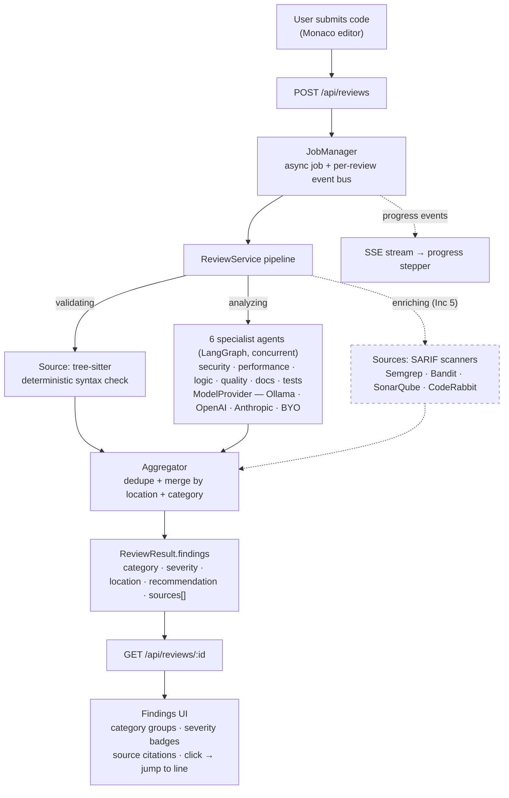

# AI Dev Companion

Intelligent, multi-step code review powered by GenAI. Submit code; get structured, categorized,
**source-cited** findings (security / performance / logic / style / syntax) with live progress.
Open-source and local-first — runs with **zero API keys** using a local model (Ollama).

> Built incrementally. This release is **Inc 0 + Inc 1** (foundation + the complete single-snippet
> review app). See the [design spec](docs/superpowers/specs/2026-05-31-ai-dev-companion-design.md)
> for the full roadmap (multi-agent, retrieval, git ingestion, SARIF scanners, auth, notifications, observability).

## Architecture
- **packages/core** — Findings schema, sanitization, tree-sitter syntax checks.
- **apps/api** — FastAPI job API + **LangGraph multi-agent engine** (6 specialists → aggregator). `POST /api/reviews` -> SSE progress -> `ReviewResult`. Pluggable `ModelProvider` (Ollama/OpenAI/Anthropic).
- **apps/web** — React + Monaco workspace (side-by-side editor/findings) + History + Settings.

## How it works

A review is an **async job**. The `ReviewService` pipeline runs each **source**, then an
**aggregator** dedupes/merges their results by `location + category` — so a single finding can
**cite multiple sources** (e.g. our agent *and* Semgrep). Every finding carries `sources[]`, and the
UI shows those as clickable citation chips.



- **`tree-sitter`** (deterministic): real parse errors → `syntax` findings, no LLM needed.
- **`core-reviewer`** (the AI agent): one structured LLM call via the pluggable `ModelProvider` →
  `security / performance / logic / style` findings.
- **SARIF scanners** (dashed = future Inc 5): Semgrep/Bandit/etc. plug in as additional sources via a
  single SARIF→Findings mapper; the aggregator attaches them to existing findings as extra citations.
- **Multi-agent (Inc 2):** a LangGraph graph fans out to 6 concurrent specialist agents (each with its own focused prompt + optional per-agent model); the aggregator dedupes/merges their findings and ranks by severity. Local models serialize on one Ollama instance — use a cloud provider for true parallelism.

> The dashed `enriching` stage is reserved in the status contract + UI today; it activates when the
> scanner fan-out lands in Inc 5. Multi-agent fan-out (parallel specialist agents) arrives in Inc 2.

## Quick start
```bash
cp .env.example .env
task up            # postgres + ollama
task pull-model    # pull qwen2.5-coder:7b (or set ADC_MODEL_PROVIDER=openai + a key)
task api           # http://localhost:8000
task web           # http://localhost:5173
```
(No `task`/go-task? The Taskfile.yml commands are short; run them directly — e.g. `docker compose -f infra/compose/docker-compose.yml up -d`, `uv run uvicorn adc_api.main:app --port 8000` from `apps/api`, `pnpm --filter web dev`.)

## API
- `POST /api/reviews` `{ "language": "python", "code": "..." }` -> `202 { reviewId }`
- `GET /api/reviews/{id}/events` -> SSE progress (`validating->analyzing->finalizing->done`)
- `GET /api/reviews/{id}` -> final `ReviewResult` (findings with `sources[]`)
- `GET /api/reviews` -> history list

## Testing
```bash
uv run pytest packages/core apps/api    # backend unit + API e2e (mock provider)
pnpm --filter web test -- --run         # frontend unit
pnpm --filter web e2e                   # Playwright (spins up mock-provider API + web)
```

## Design decisions & trade-offs
Local model default (zero keys, weaker output -> tests assert on schema not wording); stable Findings
contract with `sources[]` so later scanners (Semgrep/SonarQube) merge as citations; async job + SSE so
long multi-agent runs (Inc 2+) show progress. Full rationale in the design spec.

## Bring your own model
Set `ADC_MODEL_PROVIDER=openai`, `ADC_OPENAI_BASE_URL`, `ADC_OPENAI_API_KEY`, `ADC_MODEL` (any
OpenAI-compatible endpoint, including hosted Qwen). Anthropic adapter lands in Inc 2.

## Known limitations
Single snippet only (multi-file = Inc 3); in-memory job store (Redis = Inc 2+); no auth yet (Inc 6);
CORS is open (`*`) for local dev and must be restricted before deployment.
